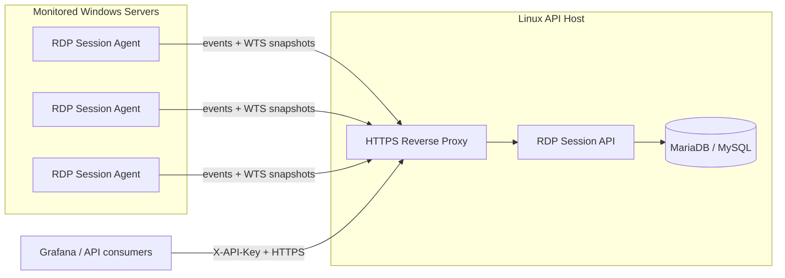

# RDP Session API

RDP Session API is the central REST service of a lightweight Remote Desktop Services monitoring stack. It receives lifecycle events and current-state snapshots from Windows servers, consolidates RDP session state, stores history, and exposes read endpoints for dashboards and integrations such as Grafana.

The project is intentionally infrastructure-agnostic. This repository does **not** contain environment-specific hostnames, credentials, private addresses, TLS material, or production reverse-proxy configuration.

The Windows collector is maintained separately in [RDP-Session-Agent](https://github.com/diogowermann/RDP-Session-Agent).

## Current capabilities

- Versioned `/api/v1` contract.
- Per-server Agent authentication with individually registered credentials.
- Administrative server registration and credential rotation.
- Idempotent Event Log ingestion.
- Consolidated session states: `ACTIVE`, `DISCONNECTED`, and `CLOSED`.
- WTS snapshot reconciliation for current-state correction.
- Separate `X-API-Key` protection for read/query endpoints.
- Cross-server LOGON alert feed designed for Grafana multi-dimensional alerting.
- SQLAlchemy persistence with Alembic migrations.
- MariaDB / MySQL production support and SQLite-compatible tests.
- Managed Linux deployment through systemd.
- Loopback-only Uvicorn deployment behind an HTTPS reverse proxy.
- JSON endpoints suitable for Grafana or other internal consumers.

## System context



## API surface

### Agent ingestion

- `POST /api/v1/agent/events`
- `POST /api/v1/agent/snapshot`

Agent ingestion requires:

```http
X-Server-ID: <server-id>
Authorization: Bearer <agent-secret>
```

### Read/query API

- `GET /api/v1/servers`
- `GET /api/v1/servers/{server_id}/summary`
- `GET /api/v1/servers/{server_id}/sessions/active`
- `GET /api/v1/servers/{server_id}/sessions/history`
- `GET /api/v1/alerts/logons?lookback_minutes=5`

Read/query endpoints require:

```http
X-API-Key: <query-api-key>
```

The LOGON alert feed returns one row per recently received, idempotently accepted LOGON event across all enabled servers. It is intended for Grafana alert rules that use `alert_id` as a unique instance label and `alert_value` as the numeric condition field.

### Operational

- `GET /api/v1/health`

## Documentation

- [Documentation index](docs/README.md)
- [Installation and configuration](docs/installation.md)
- [System architecture](docs/system-architecture.md)
- [Grafana logon alerting](docs/grafana-alerting.md)
- [systemd deployment and operations](docs/systemd.md)

## Typical onboarding flow

1. Install and configure the central API.
2. Register each Windows server with `scripts/register_server.py`.
3. Store the returned one-time Agent secret securely.
4. Install RDP Session Agent on that Windows server using its unique `server_id` and secret.
5. Validate the server summary and current sessions through the query API.
6. Repeat registration and Agent installation for each additional server.

## Security model

- Every Windows server receives a unique Agent credential.
- The API stores only a hash of each Agent secret.
- Agent credentials cannot query session history.
- Read access uses a separate query API key.
- Production deployment keeps Uvicorn on loopback and exposes only the reverse proxy.
- Runtime secrets belong in a protected environment file outside the Git checkout.

## Public repository safety

Never commit:

- production `.env` files;
- real API keys or Agent secrets;
- private DNS names or addresses;
- TLS private keys or certificates;
- database passwords;
- environment-specific reverse-proxy configuration.

All documentation examples use fictitious values intentionally.

## License

Released under the [MIT License](LICENSE).
