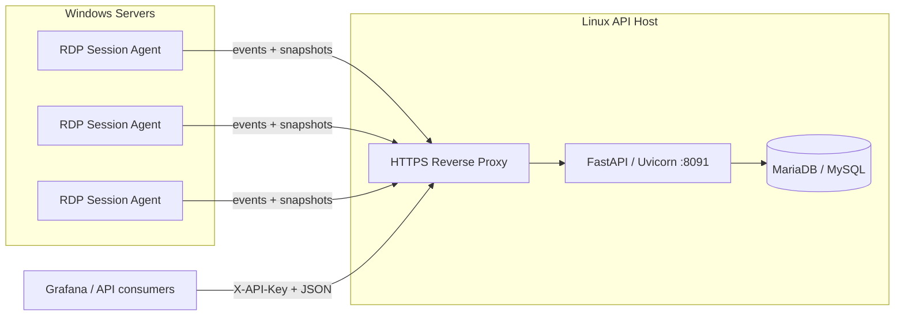
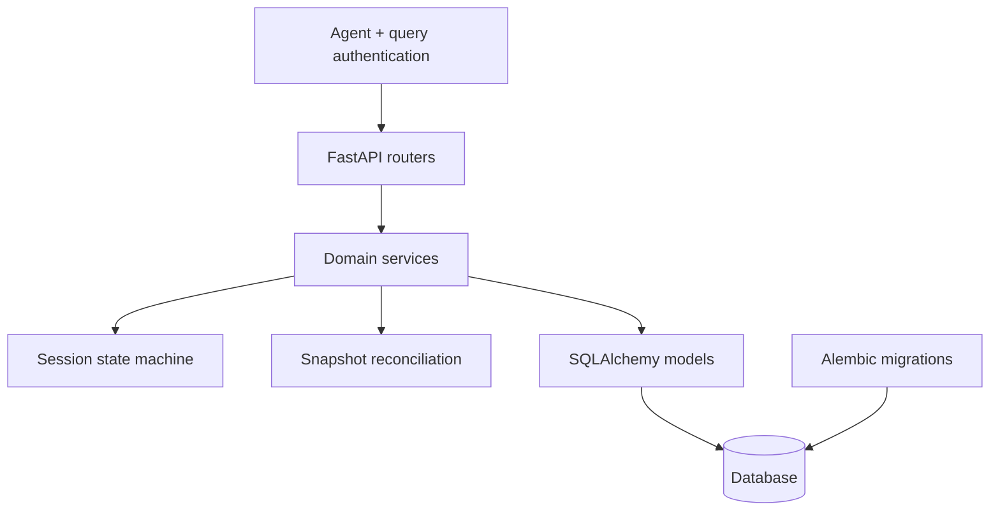
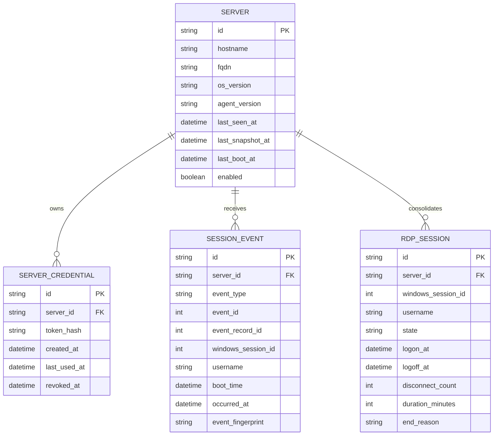
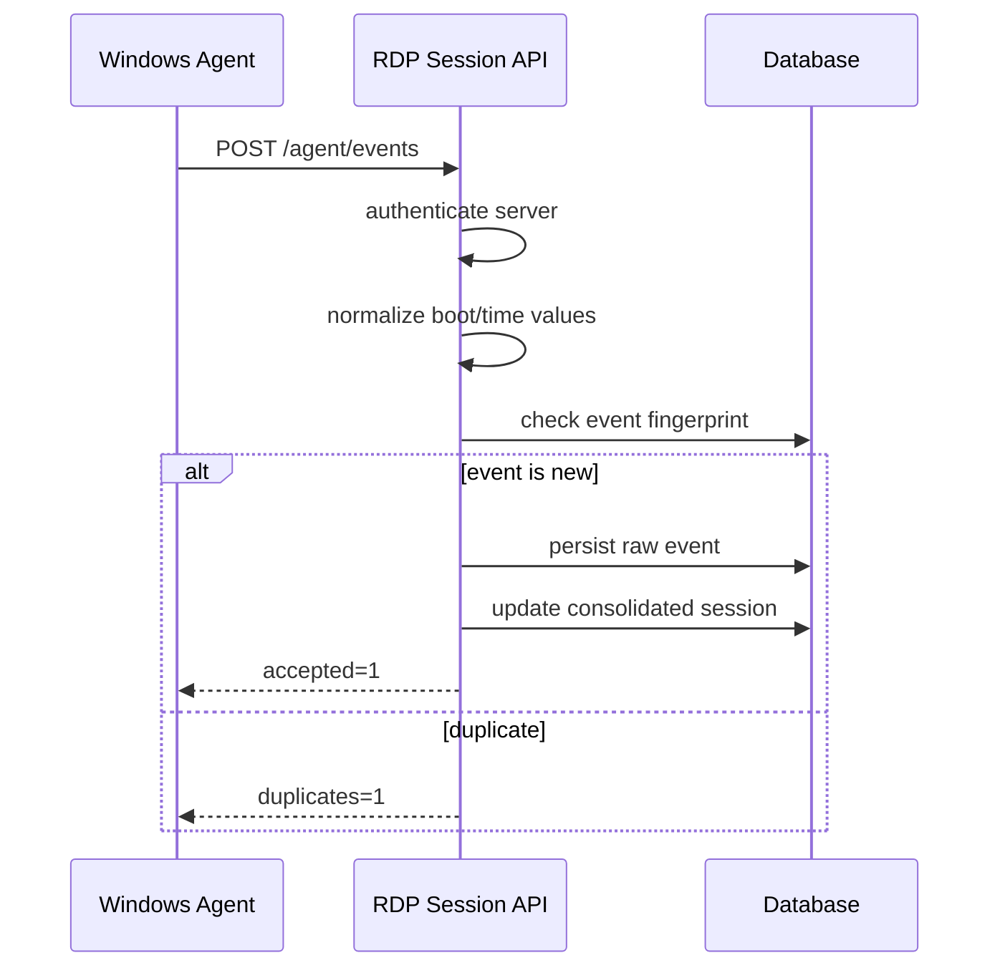
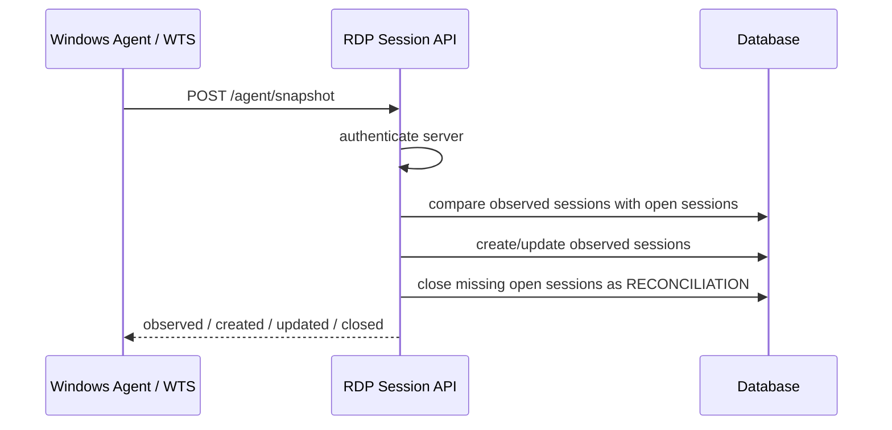
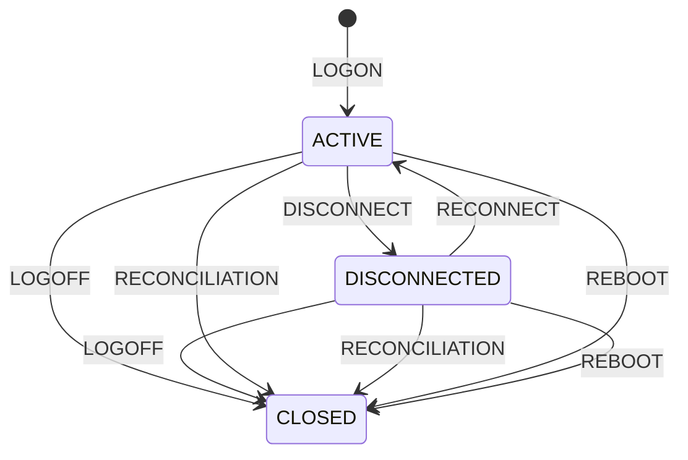
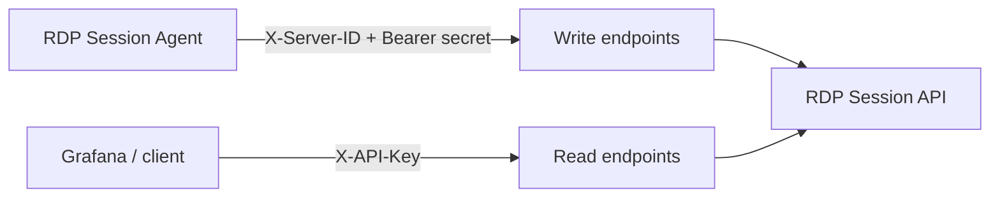
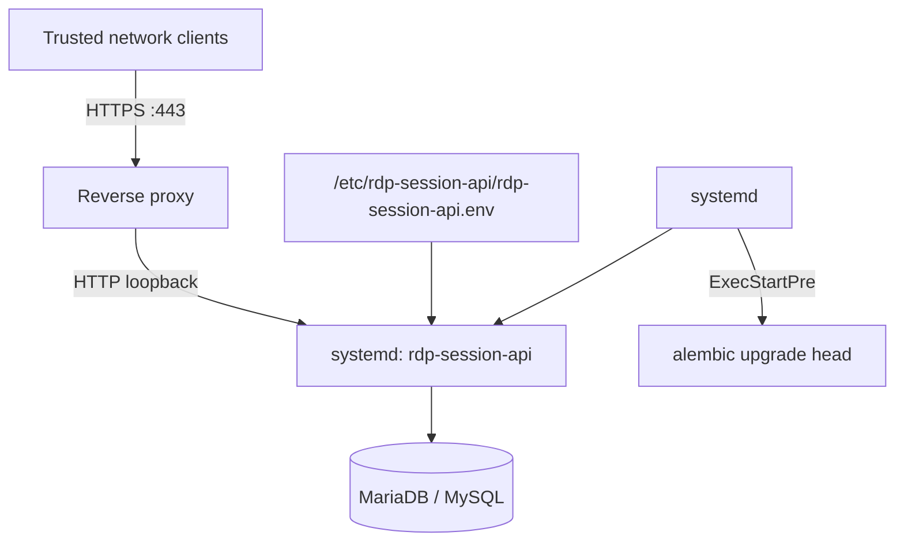
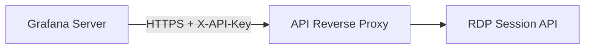

# RDP Session API — system architecture

> Technical reference for the central API. The code remains the authority when implementation and documentation differ.

## 1. Purpose

RDP Session API centralizes Remote Desktop Services telemetry from one or more Windows servers. It accepts event streams and WTS snapshots from the companion Agent, persists raw and consolidated state, and exposes read-only JSON endpoints for dashboards and integrations.

The design separates **write credentials used by Agents** from **read credentials used by consumers**.

## 2. Repositories and responsibilities

| Repository | Responsibility |
|---|---|
| `RDP-Session-API` | FastAPI service, authentication, persistence, reconciliation, query endpoints, Linux deployment |
| `RDP-Session-Agent` | Windows Event Log collection, WTS snapshots, durable spool, Scheduled Task execution |

## 3. Context view

## 4. Trust boundaries

1. Agents authenticate with a server-specific `X-Server-ID` and Bearer secret.
2. Each monitored server receives an independent Agent credential.
3. The API stores only a hash of the Agent secret.
4. Read/query clients authenticate separately with `X-API-Key`.
5. Uvicorn is intended to stay on loopback behind a TLS reverse proxy.
6. Database credentials and query keys live outside the Git checkout.
7. TLS private keys and environment-specific proxy configuration are not repository content.

## 5. Internal components

### API routers

Expose ingestion, health, server summary, active session, and history endpoints.

### Domain services

Apply idempotency, normalize timestamps, update consolidated state, and reconcile WTS observations.

### Persistence

The API uses dedicated SQLAlchemy models and Alembic migrations instead of writing to an unrelated application's database.

## 6. Main data model

## 7. Event ingestion flow

Event fingerprinting makes replay safe when the Agent resends a locally spooled batch.

## 8. Snapshot reconciliation flow

The snapshot is a current-state correction mechanism. It complements Event Log ingestion rather than replacing it.

## 9. Session state machine

### End reasons

Typical terminal reasons include:

- `LOGOFF` — lifecycle event explicitly closed the session;
- `RECONCILIATION` — WTS no longer observed an open session;
- `REBOOT` — a different boot instance invalidated sessions from the previous boot.

## 10. Authentication model

Agent credentials intentionally cannot be used to read global session history.

## 11. Deployment model

The bundled systemd path provides:

- dedicated non-login service account;
- loopback-only Uvicorn bind;
- migration preflight;
- automatic restart;
- journald logging;
- basic service hardening.

## 12. Multi-server onboarding

For every additional Windows server:

1. register the server in the API;
2. receive its unique `server_id` and one-time secret;
3. install the companion Agent using those values;
4. validate `/servers/{server_id}/summary`;
5. repeat without sharing credentials between servers.

No API deployment change is required when adding another monitored server.

## 13. Grafana integration

Grafana is a read-only consumer of the API and can run on a separate host.

Useful dashboard sources include:

- server list;
- active users;
- active/disconnected/open session counts;
- active session table;
- session history.

The Grafana host must trust the certificate chain used by the API endpoint.
